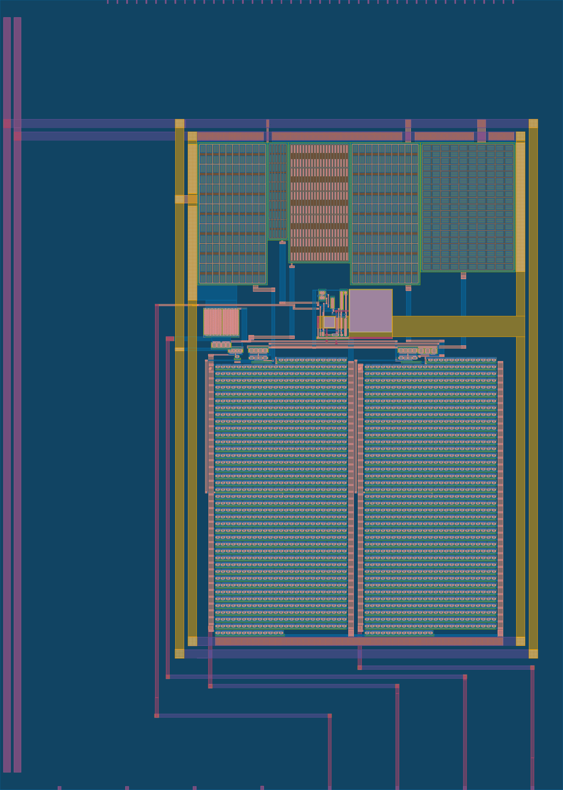

  

# SKY130 Spiking Neuron (4 pins)

CMOS realization of an Izhikevich-style spiking neuron.

This is a Tiny Tapeout analog project in one `1x2` tile.
It uses the SKY130 1.8 V devices.
The circuit is fully analog.
The digital pins and clock are not used.

## Circuit

The neuron has internal `V` and `U` state nodes.
They act like the membrane voltage and recovery variable in the Izhikevich model.

CMOS OTAs, current mirrors, resistors, and MIM capacitors create the analog dynamics.
The large repeated layout blocks include matched transistor arrays, resistor structures, and capacitors.
An output buffer drives the observable spike waveform at `VOUT`.

## Analog Pins

| Pin | Name | Use |
| --- | --- | --- |
| `ua[0]` | `IREFB` | Bias for the `V` dynamics |
| `ua[1]` | `VOUT` | Spike output voltage |
| `ua[2]` | `IREFA` | Bias for the `U` dynamics |
| `ua[3]` | `BIASC` | Common control bias |

## How To Use

Power the chip from `VDPWR = 1.8 V`.
Apply quiet analog bias voltages to `IREFB`, `IREFA`, and `BIASC`.
Observe `VOUT` with an oscilloscope or DAQ.

Changing the three bias pins changes the spike shape, rate, and stability.
The circuit can show spike-like relaxation oscillation.
It is an analog CMOS implementation inspired by the Izhikevich neuron, not a digital simulator of the equation.

## Project Info

Top module: `tt_um_izh_neuron`

Authors: Abdulkarim Alorf, Tomohisa Kawakami
